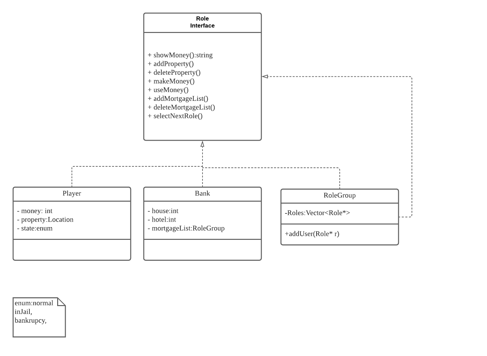
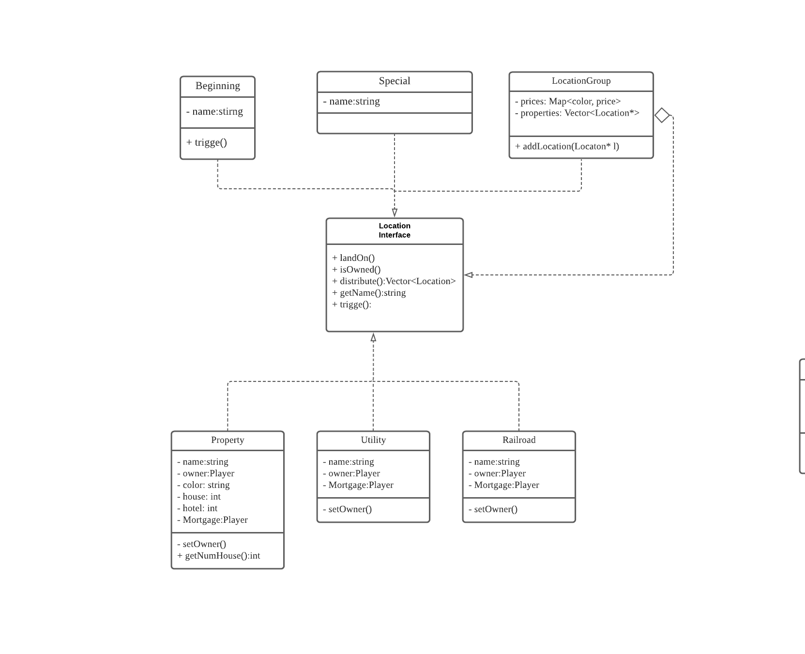
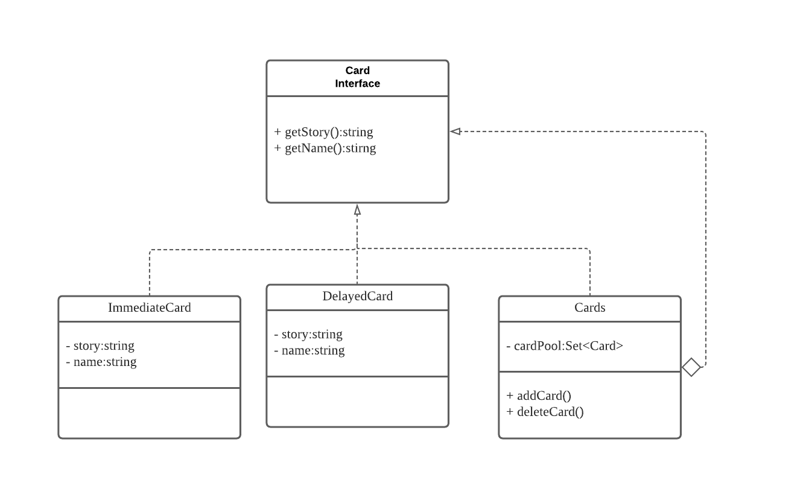
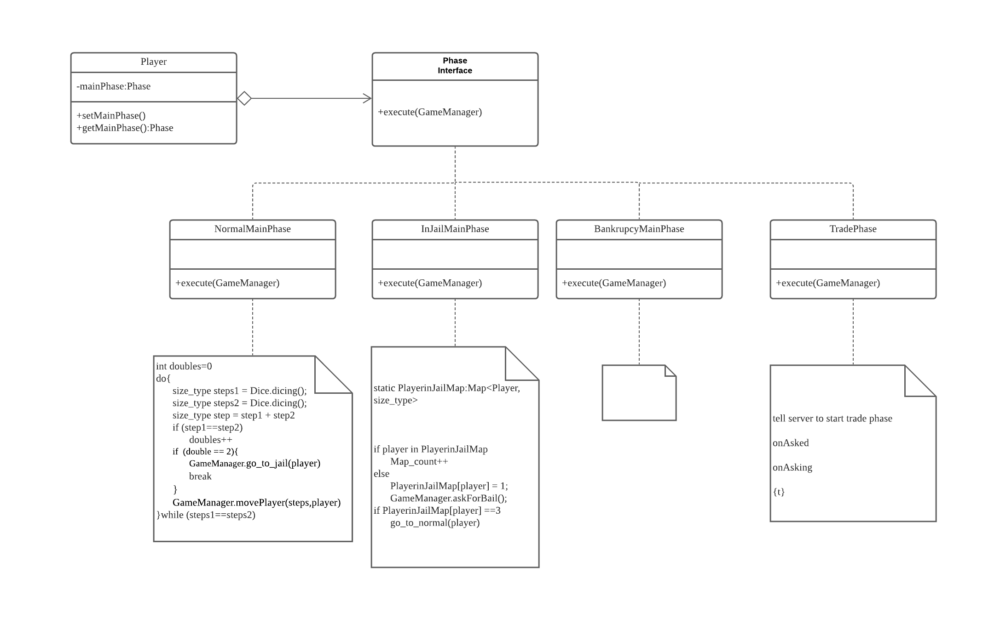
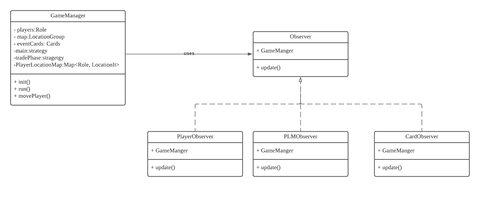
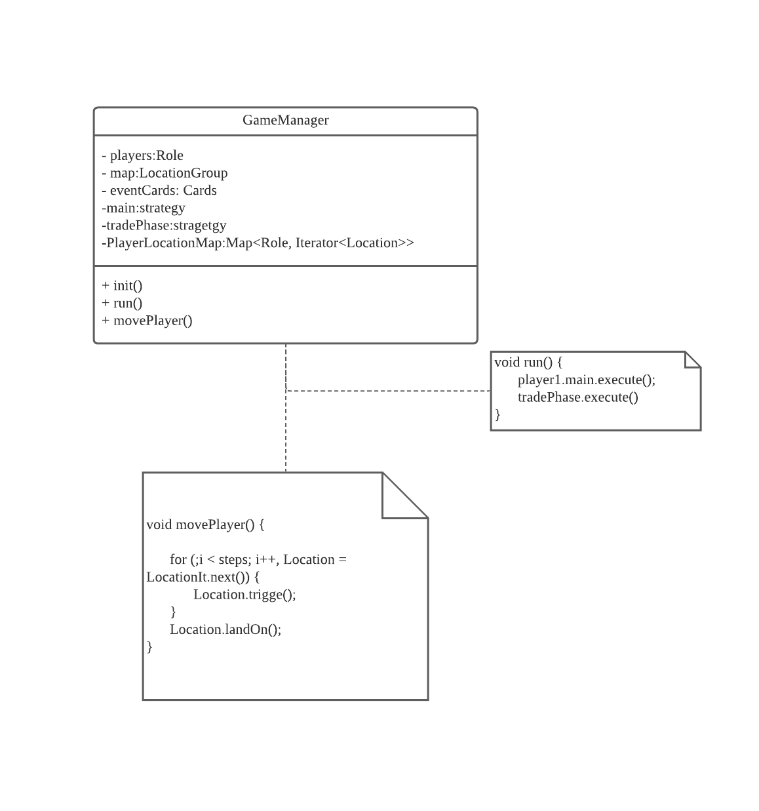
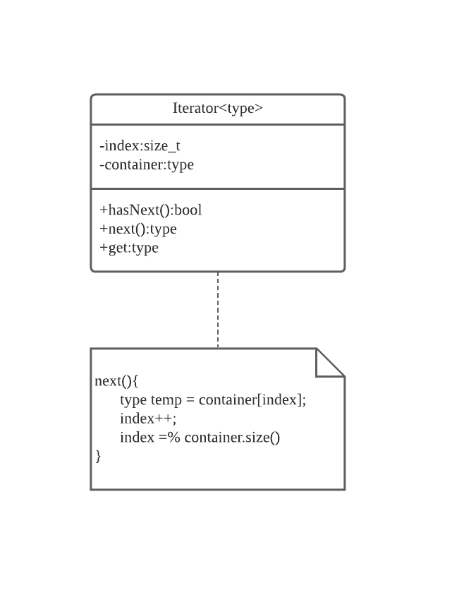
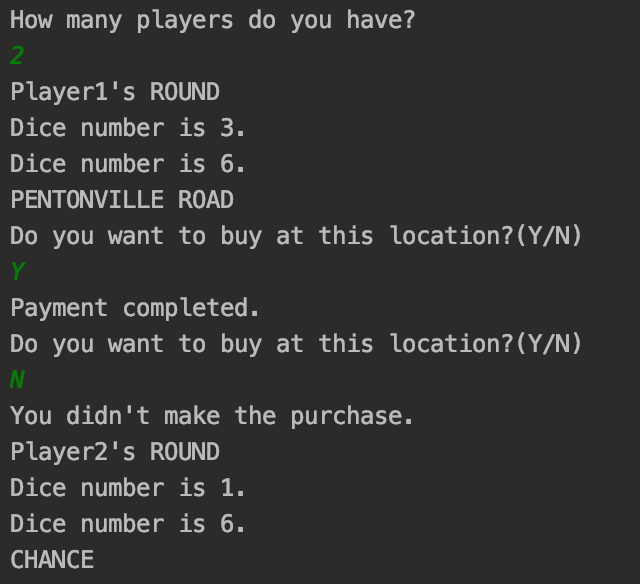

# Monopoly

  Authors:  <[Xianghu Wang](https://github.com/sakuragirl-123)>

  ​				<[Baichuan Qin](https://github.com/Jackie-Qin?tab=repositories)>

  ​				<[Xinglan Liu](https://github.com/hereistheusername)>

## Project Description

* Why is it important or interesting to you?

  The Monopoly board game is fun, and building it can help us practice some design patterns. Generally there are four players (could be more or less). Each player has a start-up money, and they will play as items on a game board. The board has 40 grids, and players use dice to move. Different scenarios will take effect when landing on different grids. For instance, players can buy properties, can update them. Also players could get chance cards which contains both rewards and punishment. They could also be sent to the jail grid which limit their movements. The goal is to earn the most money (for both cash and properties) in a chosen rounds.
  
* What languages/tools/technologies do you plan to use?

  C++

  [Qt](https://en.wikipedia.org/wiki/Qt_(software))

* What will be the input/output of your project?

  Input: Mouse click events

  Output: display changes

* What are the three design patterns you will be using? 

  **Observer**: Implement to our UI control management class. When our GUI controls use observer mode, the associated objects will be notified of any user interface related operations and changes. For instance, if one player's property or money changed, other players will receive notification where the change happened. And it is necessary to have all the players' information updated whenever change happens.

  **Abstract Factory Pattern**: Encapsulate an interface, which is responsible for creating a series of interrelated objects. It will be easy for us to create and manage subclasses of the same type of batch. For example, every single node in the map belongs to the same abstract class, but when we come to implement them they will have different methods so it’s necessary to use the unified interface management.

  **Strategy**: This pattern can change classes’ behavior or algorithm in runtime. In the game, there are many places where strategy pattern is needed. When a player's state changes, for example being punished, that player should go through another flow different from normal flow. Also like chance card, some will take effect immediately, some will later. We have to use strategy pattern to control different behaviors.

## Phase II

## Class Diagram

### Role (Composite Pattern)

This class uses the composite design pattern to organize the relationship between players and game bank. It has the leaf nodes player for each player and bank for the game bank. We use the composite Role Group to manage all the attributes and states of players and game bank.

### Location ( Composite Pattern)

This class also uses the composite design pattern to represent all the map resources and their organization form. It has the leaf nodes including Property, Utility, Railroad, Beginning and special. We use the Location Group composite to manage each map resource and take control of their attributes.

### Card (Composite Pattern)

There are many types of cards, and to have a better control of it, we divide cards by when they take effect. The immediate cards, delayed cards which describe when they will take effect are the leaves. The composite is a card class which helps to add and delete cards at beginning or cards being drawn.

### Phase (Strategy Pattern)

It is used to change players' behavior at runtime. For example, if a player goes to jail, this player cannot both throw the dice and move. And bankrupt strategy is prepared for bankrupt players. In the trade process, players can trade properties and hotels.

### Game Manager (Observer Pattern)

In order to update changes to every player, we build this game manager which uses the observer pattern. It will notify others when changes happen like players’ movement, drawing cards, building properties.

### Iterator for Roles and Locations (Iterator)

We need to build our own iterator to traverse containers like role and location. For instance, the location container will have every location’s information and effect method.

### Rules

All class diagrams are followed rules

[Rules](./rules.md)

 > ## Final deliverable
 > All group members will give a demo to the TA during lab time. The TA will check the demo and the project GitHub repository and ask a few questions to all the team members. 
 > Before the demo, you should do the following:
 > * Complete the sections below (i.e. Screenshots, Installation/Usage, Testing)
 > * Plan one more sprint (that you will not necessarily complete before the end of the quarter). Your In-progress and In-testing columns should be empty (you are not doing more work currently) but your TODO column should have a full sprint plan in it as you have done before. This should include any known bugs (there should be some) or new features you would like to add. These should appear as issues/cards on your Kanban board. 
 ## Screenshots
 
 
 ## Installation/Usage
  Git clone to local.  
  cmake .  
  make   
  ./Game
 ## Testing
 How was your project tested/validated? If you used CI, you should have a "build passing" badge in this README.
 
 We created tests for each class.

